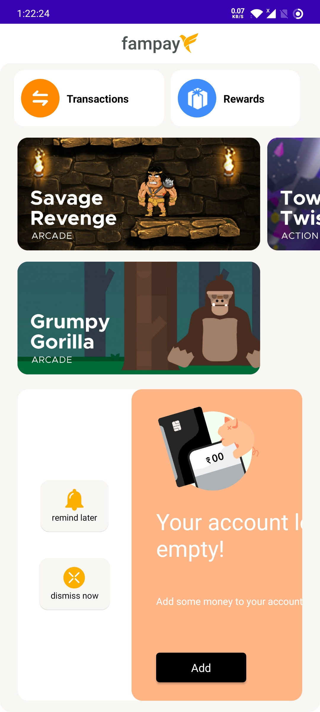

# Fampay

Fampay AAL3 - Android Assignment

APK - [download](https://github.com/Vishalghyv/fampay/blob/main/app-debug.apk)

## Technical Details
- Framework - Kotlin + XML
- MVVM model

- API : [https://run.mocky.io/v3/04a04703-5557-4c84-a127-8c55335bb3b4](https://run.mocky.io/v3/04a04703-5557-4c84-a127-8c55335bb3b4)
- Design: [https://www.figma.com/file/AvK2BRGwMTv4kQab5ymJ0K/AAL3-Android-assignment-Design-Specs](https://www.figma.com/file/AvK2BRGwMTv4kQab5ymJ0K/AAL3-Android-assignment-Design-Specs)

## Installation

Clone this repository and import it into **Android Studio**
```bash
git clone https://github.com/vishal/fampay
```

## Screenshots

### Landing Page


### Loading Page


### Scrollable


### HC3



## Generating signed APK

From Android Studio:
1. ***Build*** menu
2. ***Generate Signed APK...***
3. Fill in the keystore information *(you only need to do this once manually and then let Android Studio remember it)*
